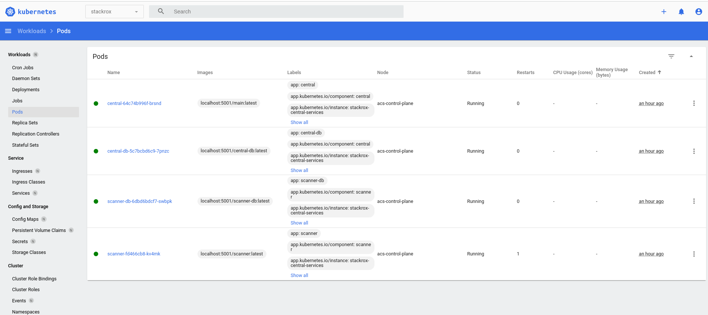

# rhacs-kind
A development setup for RHACS operator-based deployment in a Kind cluster that uses a local registry.

## Prerequisites
1. Installed kind and docker
3. Clone your fork of this repository and in it clone the other repositories (#todo use make to clone).
  ```
  $ git clone git@github.com:<user>/rhacs-kind.git
  $ cd rhacs-kind
  $ git clone git@github.com:<user>/stackrox.git
  $ git clone git@github.com:<user>/scanner.git
  ```

## Set up the kind cluster

1. Create the cluster.
```
$ make create-cluster
```

2. Run k8s dashboard for monitoring your work.
```
$ make run-k8s-dashboard

# Use the token below and go to the link provided
$ make run-k8s-dashboard
```

## Set up scanner

1. Initialize the scanner build.
```
$ make init-scanner-build
```

2. Build and push scanner.
```
$ make build-scanner build-scanner-db
$ make push-scanner push-scanner-db
```

3. Build and push central
```
$ make build-central
$ make push-central
```

## Now that all the required images are pushed the operator can now be run locally.

1. Build and run the stackrox operator

```
$ make build-operator run-operator
```

2. Apply an example Central CR

```
$ kubectl crate ns stackrox
$ kubectl apply -n stackrox -f tests/common/central-cr.yaml
```

## Develop

1. To develop, just rebuild the images accordingly and restart a pod or redeploy central services.

## K8s Dashboard



## Todo
1. Automate commands above as possible
